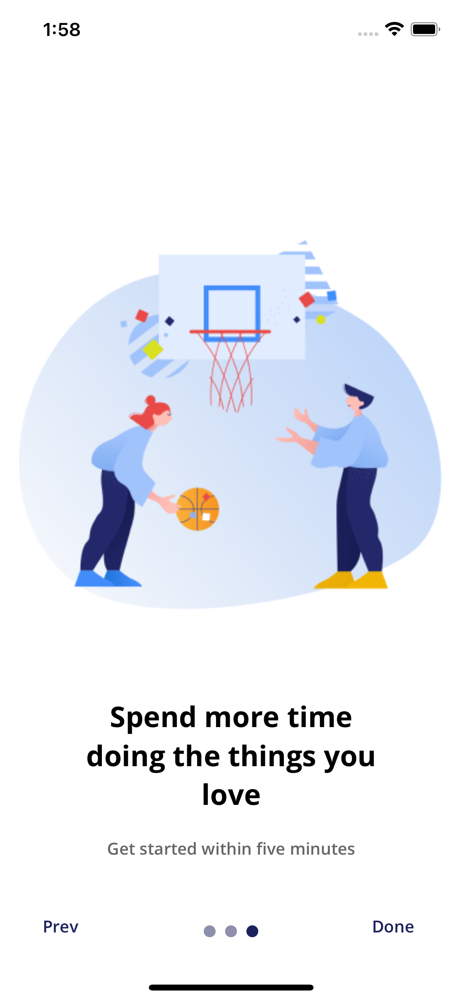

# React Native - OnboardUI

---

### UI on Figma:

[https://www.figma.com/file/iLqnRcTWEEwcXmzc2xZsQl/Onboard-UI?node-id=0%3A1](https://www.figma.com/file/iLqnRcTWEEwcXmzc2xZsQl/Onboard-UI?node-id=0%3A1)

---

### Info

App made using ReactNative with Expo CLI,  
all assets are from [figma file](https://www.figma.com/file/iLqnRcTWEEwcXmzc2xZsQl/Onboard-UI?node-id=0%3A1)

---

#### Prewiew

First Screen:

Second Screen:

Third Screen:

